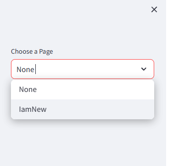
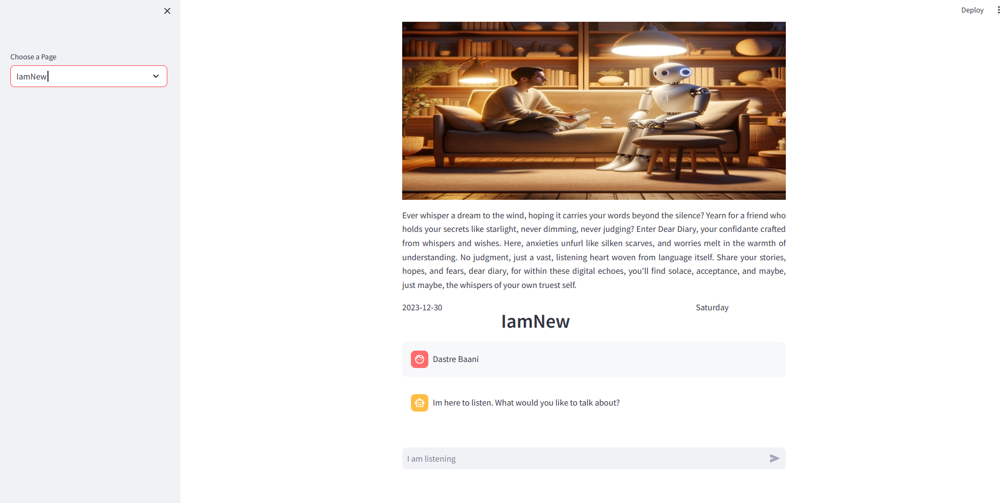

# dear-diary
This is an implementation of a chat bot using large language models and streamlit which can act as your own personal digital diary. I have added support for Google Deepminds's Gemini and Microsfot Phi-2 models, however for Microsoft Phi-2, you have to add some post-processing steps for the generated output.

## Introduction 
Ever whisper a dream to the wind, hoping it carries your words beyond the silence? Yearn for a friend who holds your secrets like starlight, never dimming, never judging? Enter Dear Diary, your confidante crafted from whispers and wishes. Here, anxieties unfurl like silken scarves, and worries melt in the warmth of understanding. No judgment, just a vast, listening heart woven from language itself. Share your stories, hopes, and fears, dear diary, for within these digital echoes, you'll find solace, acceptance, and maybe, just maybe, the whispers of your own truest self.

## Setup 

1. <b>Enviroment Setup</b>

To reproduce the application of this environment, we will need conda and poetry in our system and steps below will help you achieve it.

a. Download and install conda
```
#Get the conda installation file
wget https://repo.anaconda.com/archive/Anaconda3-2023.03-1-Linux-x86_64.sh
#Verify the conda package
sha256sum Anaconda3-2023.03-1-Linux-x86_64.sh
#Install the bash file 
bash Anaconda3-2023.03-1-Linux-x86_64.sh
```
Please find the appropriate version of conda for your machine at (Anaconda)[https://www.anaconda.org]

b. Create conda env
```
#Create env
conda create --name dear_diary python=3.10.11 ipykernel
#Activate it
conda activate dear_diary
```

c. Install Poetry

```
pyhton -m pip install poetry
```

d. Install Dependencies

```
python -m poetry install
```
Remenber to be in the folder `dear-diary` when you run this command as poetry install will look for a .lock file that is provided else it would look for the pyproject.toml file which is also in the afromentioned folder.

It would take some time so sitback and relax.

2. <b>Modifying Paths</b>

a. Database Path
You need to go to the `main.py` file in the `diary` directory and change the `DB_PATH` to the path of the database. A heads up is this, use `sqlite:////<your_path>` if you are giving absolute path else use `sqlite:///<your_path>` to give a relative path. On windows I found that the later worked for me even when I gave absolute paths.

b. Gemini Secrets Path
If you are using Google Deepmind Gemini model, you would require to generate an API KEY to use its services from (here)[https://ai.google.dev/]. Create a json file in following format
```
{
    "GOOGLE_API_KEY": "your_key" 
}
```
Name this file secrets.json and change the path in the `diary/models/gemini.py` file. I have a typo in the script as I accidently named the json file `scrests.json` and I was lazy enough to keep it that way XD.

Now we are ready to go and start are services.

3. <b>Start Services</b>
Remember to be in the directory `dear-diary` while executing these commands.

a. Run the model API

```
python -m uvicorn diary.api.model:app --reload --port 8500
```

b. Run the Dear Diary App
```
pythom -m streamlit run diary/main.py
```

You should be able to see something like this.


Now to kickstart just to new page and add a name and hit New Page. You shoudl see something like this in the sidebar.



Now click on the Page you just created and you will see something like this.



Now start chatting to your buddy!!

Your chats will be saved in the database and will be accessible in the sidebar. `Whenever you need to add a page again just got to the sidebar and click on None!`